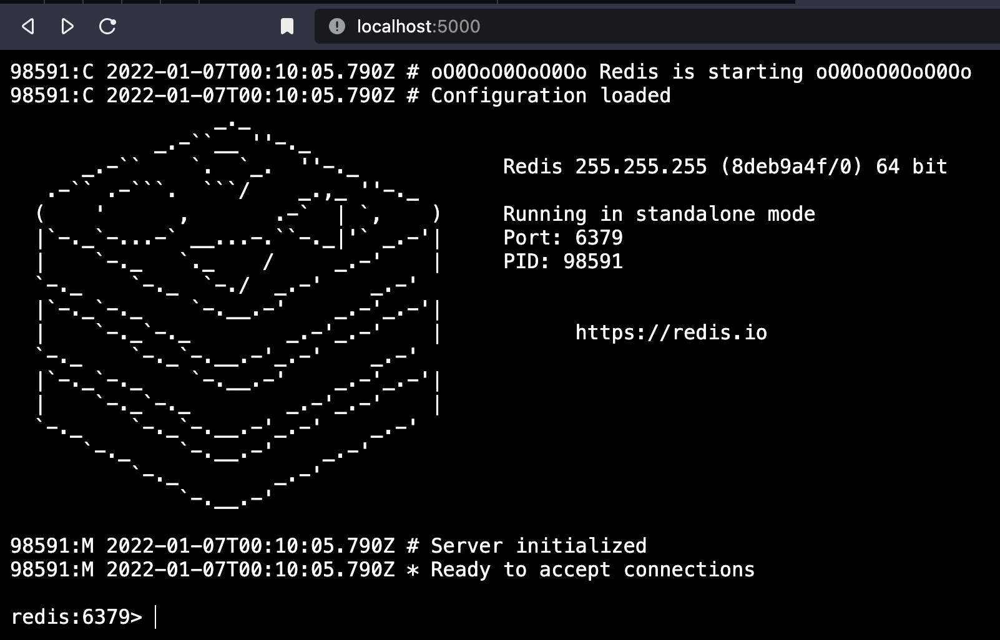

# redis-clinterwebz: a redis-cli in your browser



This project is a browser-based _redis-cli_-like interface.
It is mainly intended to serve as the interactive backbone for the https://redis.io website.
The project boasts:

* An arcane out-of-the-box TTY experience
* Multiple named Redis databases (e.g. latest, unstable...)
* Key namespacing per DB
* Opt-in per page context (allowing it to be used in the same website across multiple pages)
* Embeddable JavaScript code
* ... and much more!

## Getting started

You can use `docker-compose`:

1. Clone this repository
1. Change directory to the repository
1. Do `docker-compose up` to spin up the app, a webserver and an unstable Redis

The app should be accessible in your browser at http://localhost 
### Running the application for development

1. Clone this repository
1. Change directory to the repository
1. (Recommended) Use _virtualenv_: `virtualenv -p 3.9 venv; source venv/bin/activate`
1. Install the app: `pip install -e .`
1. Copy-paste this to your terminal:
    ```bash
    export FLASK_APP=interwebz
    export FLASK_ENV=development
    export INTERWEBZ_JSON_SETTINGS=`pwd`/sample_settings.json
    ```
1. To run: `flask run`

The app should be accessible in your browser at http://localhost:5000
#### Redis Server

To function correctly, the application requires one or more Redis servers.

The minimal Redis version required is 7.0.0 (until it is released, please install directly from the source at the __unstable__ branch of the Redis repository).

An example for a hardend ACL profile is included in the __redis__ directory. To use it:

```bash
cd redis
redis-server redis.conf
```

### Deploying on k8s

WIP

```
kubectl port-forward --namespace=ingress-nginx service/ingress-nginx-controller 8080:80
https://kubernetes.github.io/ingress-nginx/deploy/#quick-start
make up
```

## Configuration

To override the defaults (see _default_settings.py_), you can provide your own settings file via the _INTERWEBZ_SETTINGS_ environment variable, like so:

```bash
EXPORT INTERWEBS_SETTINGS=/path/to/your/settings.py
flask run
```

Alternatively, you can also use a JSON file for the same purpose (see _sample_settings.json_) via the _INTERWEBZ_JSON_SETTINGS_ environment variable.

## HTML redis-cli element

To embed in an HTML page:

1. Import the _cli.js_ script.
2. Add a `div` element with the `redis-cli` class.
3. Add a `pre` element to the `div`.
4. Add any commands you want to run before the user prompt in the `pre`.

### Attributes

The _redis-cli_ element supports these attributes:

* _dbid_: the database ID to use, defaults to the first defined databse.
* _asciiart_: controls ASCII art display
* _handshake_: creates a new session per page load

## TODO

* Embedded comments inline :)
* Testing
* Deployment
* Request/IP throttling
* ...